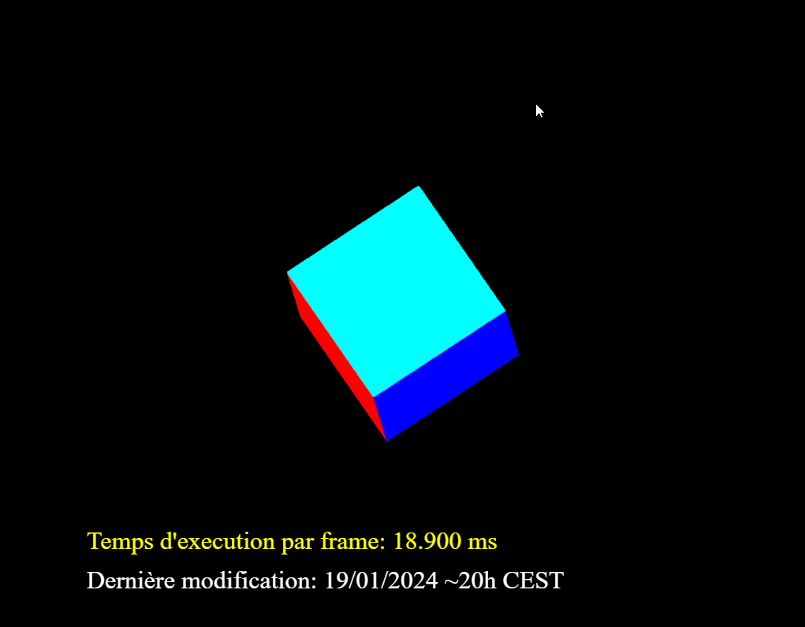

## Simple compilation of some bit of codes
----------------------
----------------------

| 3D projection render | Bézier  |
| -------------------- | ------- |
|  |  |
| [Code](./3D_test/) | [Code](./bezier/) | 

| 3D car on map | Particles  |
| -------------------- | ------- |
|  |  | 
| [Code](./cars/) | [Code](./particles_simulation//) | 

| Pong | Old School Rasterizer  |
| -------------------- | ------- |
|  |  | 
| [Code](./pong_color/) | [Code](./rasterizer/) | 
